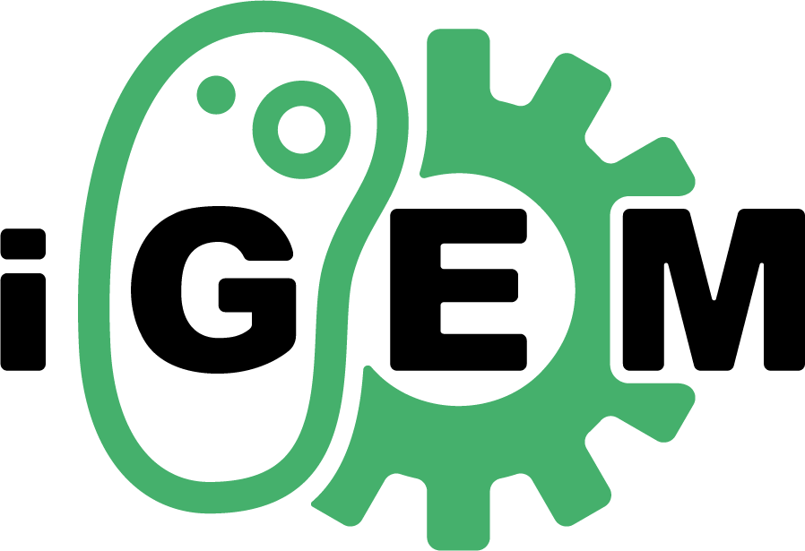

# iGEM Wiki Design

<a href="https://igem.org/"></img></a>

## 介绍

[施工中]

## 在线预览

[施工中]

## 协同开发

**请先参考 `doc/` 目录下的文档，尤其是 [Structure.md](./doc/Structure.md)**

**需要 `npm`, `git` 等作为前提工具，请确保你已经安装。如未安装参考 [Installation.md](./doc/Installation.md)。**

**下述基于 Windows 11 系统。**

### 本地部署项目

1. `clone` 该仓库到本地。
   
   ```shell
   git clone https://github.com/foeyt/igem-wiki-design.git
   ```

2. 进入项目目录。

   ```shell
   cd ./igem-wiki-design
   ```

3. 安装所需依赖。

   ```shell
   npm install
   ```

4. 启动本地预览服务器。

   ```shell
   npm run dev
   ```

### 开始开发

**需要创建个人分支，开发后提交 Pull Request，经 Review 才可合并到 main。**

**不熟悉命令行操作的，可以使用 VSCode 的可视化工具。**

1. 确保本地仓库处于最新状态。

   ```shell
   git checkout main
   git pull origin main
   ```

2. 创建并切换到新分支，分支命名请输入自己的 GitHub Name 并小写，用 “-” 代替空格。

   ```shell
   git checkout -b <branch_name>
   ```

3. 在新的分支上编写代码并提交，建议经常提交代码，提交信息按照下面的格式，建议使用英文。

   ```txt
   添加新功能：[Add]<GitHub Name>: 新功能介绍
   更新源代码：[Update]<GitHub Name>: 更新内容
   修改 Bug: [Fix]<GitHub Name>: 修改的 Bug
   ```

4. 本地分支推送到 GitHub。

   ```shell
   git push -u origin <branch_name>
   ```

5. 开发周期较长时，建议定期更新 `main` 分支，避免出现大量分支冲突。

   ```shell
   方法一：合并（merge）
   git checkout main
   git pull origin main      # 更新本地 main
   git checkout <branch_name>
   git merge main            # 将 main 的更新合并到当前分支
   # 如有冲突，解决后提交
   
   方法二：变基（rebase）（使历史更线性）
   git checkout <branch_name>
   git fetch origin          # 获取远程更新
   git rebase origin/main    # 将当前分支变基到最新的 main
   # 如有冲突，解决后 git add . 然后 git rebase --continue
   ```

6. 向 Reviewer 提交 Pull Request，Pull Request 请认真填写。

## 团队分工

[施工中]
